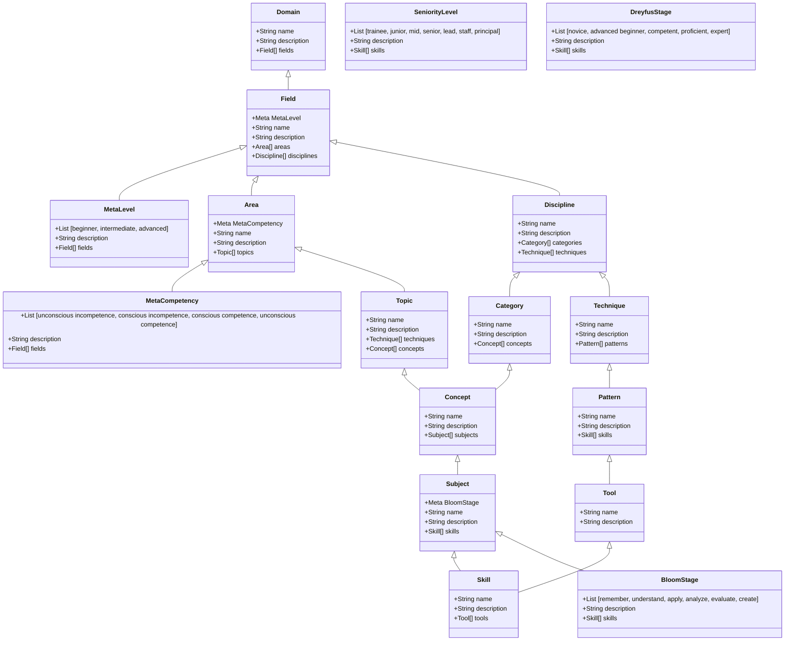

# Gamified Learning App
## Overview
- deeply structured taxonomy (domain, field, area, discipline, category, topic, technique, concept, subject, pattern, skill, tool, method)
- the app is at the intersection of knowledge management, career development and personal growth
- with a serious tone but a playful UX

## Name Ideas by theme:
- mission & mastery - emphasize progression, master, and structured growth: skillforge, levelpath, masterygrid, learnops, stackmaster, growthlayer, devascend, competencyquest, evolvestack
- taxonomy & structure inspired - reflects the layered and organized nature if your framework: taxoniq, skillmesh, knowmatrix, layeredlearn, knwograph, concepttreee, skillframe, fieldnode
- gamification inspired - suggests game mechanics, leveling up, and interactive learning: skillxp, questboard, levelupdev, xptrack, badgetower, devquested, pathrpg, codehustle, learnsaga, progressor
- tech-centric with playful edge - works well for engineers but keeps the name catchy adn tech-savvy: engihuity, codeorbit, stackorbit, skillops, bitforge, nodeup, devdrive, looplearn, syntaxxp, brainstack
- growth & evolution themes - good if your app is also geared toward soft skills or long-term growth: growthgrid, evolveiq, climbtrack, learnbloom, devroots, ascendiq, trackthrive, skillsprout, nextbranch, metalayer

# Idealization
 
Domain:
    - e-Commerce, FinTech, Online Gambling, Healthcare IT, DeFi

Field:
    - meta: level (beginner, intermediate, advanced)
    - examples: software engineering, data engineering, devops, machine learning, cybersecurity

Area:
    - meta: competency (unconscious incompetence, conscious incompetence, conscious competence, unconscious competence)
    - examples: software architecture, front-end development, back-end development, testing & qa, cloud infrastructure

Discipline:
    - meta: competency (unconscious incompetence, conscious incompetence, conscious competence, unconscious competence)
    - examples: computer science, human-computer interaction, software project management, system design

Category:
    - meta: competency (unconscious incompetence, conscious incompetence, conscious competence, unconscious competence)
    - examples: API Design, Database Management, Auth & Autz, Asynchronous Programming, CI/CD

Topic:
    - meta: competency (unconscious incompetence, conscious incompetence, conscious competence, unconscious competence)
    - examples: security, data-access layer, state management, data modeling, data pipeline

Technique:
    - meta: competency (unconscious incompetence, conscious incompetence, conscious competence, unconscious competence)
    - examples: test-driven development, domain-driven design, microservices architecture, event-driven architecture, serverless architecture

Concept:
    - meta: competency (unconscious incompetence, conscious incompetence, conscious competence, unconscious competence)
    - examples: solid principles, gof design patterns, enterprise design patterns, clean architecture, hexagonal architecture, cap theorem, eventual consistency, referential transparency

Subject:
    -meta: bloom stage (remember, understand, apply, analyze, evaluate, create)
    - examples: jwt authentication, typeorm, redux
  
Pattern:
    -meta: bloom stage (remember, understand, apply, analyze, evaluate, create)
    - examples: gof patterns, cqrs patterns, event sourcing, command query separation, saga pattern, circuit breaker pattern

Skill:
    -meta: bloom stage (remember, understand, apply, analyze, evaluate, create)
    - examples: write unit tests with jest, design rest-ful api, write secure sql queries, optimize react.js performance, setup ci/cd pipeline

Tool:
    - meta: bloom stage (remember, understand, apply, analyze, evaluate, create)
    - examples: jest, react.js, typescript, node.js, postgresql, docker, kubernetes, aws, postman, docker, git, github, bitbucket, jenkins, circleci, travis-ci, heroku, vercel, netlify, firebase

Role:
    - meta: seniority level (trainee, junior, mid, senior, lead, staff, principal)
    - examples: software engineer, data engineer, devops engineer, machine learning engineer, data scientist, data analyst

Responsibility:
    - meta: seniority level (trainee, junior, mid, senior, lead, staff, principal)
    - examples: own e2e deployment pipeline, ensure uptime and observability or production services