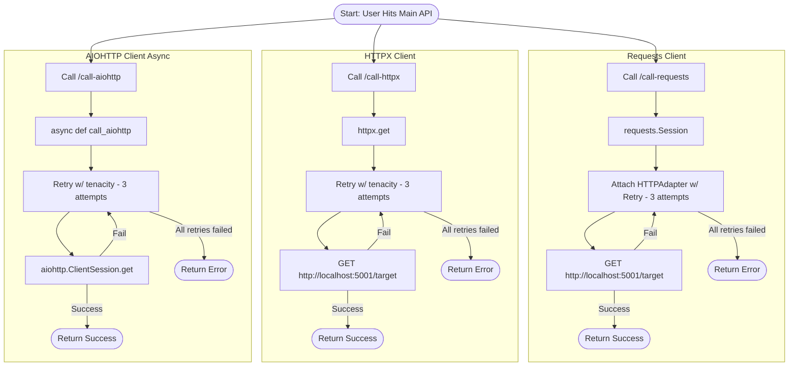

# HTTP Client Comparison

- `requests` - synchronous HTTP client
- `httpx` - drop-in replacement for `requests` that also supports async
- `aiohttp` - fully sync with `asyncio`

## Comparison Requirements

### **Requirement** 1: Retry Strategy Flexibility

The system must support configurable retry strategies with the following parameters:

- max_retries: Maximum number of retry attempts before failing.
- max_retry_time: Maximum cumulative time allowed for all retry attempts.
- backoff_strategy: Support for both:
  - Exponential backoff (e.g., wait = base \* (2 \*\* n))
  - Inverse exponential backoff (e.g., wait = base / (n + 1) or custom-defined inverse strategies)
    These parameters must be injectable/configurable per HTTP client and should allow seamless swapping between strategies at runtime or via configuration.

### **Requirement** 2: Session-level Retry Hooks and Conditions

The system must allow defining retry conditions and lifecycle hooks at the session/client level. Specifically:

- Ability to specify custom retry conditions, e.g.:
  - Retry on status codes like 5xx, connection errors, or timeout exceptions.
  - Retry on application-specific error patterns in the response body or headers.
- Ability to inject the following hook methods:
  - before_retry(attempt_number, exception, delay): Executed before each retry. Can be used for logging, metrics, side-effects, or conditional overrides.
  - after_retry(attempt_number, response): (Optional) Executed after each retry if it succeeds.
  - Retry logic should integrate with max_retries, max_retry_time, and the selected backoff strategy.

### **Requirement** 3: Error Handling and Logging

The system must provide robust error handling and logging capabilities:

- Log all retry attempts, including:
  - Attempt number
  - Exception details (if any)
  - Delay before the next retry
- Log final success or failure after all retries.
- Support structured logging formats (e.g., JSON) for easy parsing and analysis.

### **Requirement** 4: Performance and Resource Management

The system must ensure that retry logic does not lead to resource exhaustion or performance degradation:

- Implement safeguards to prevent infinite retry loops.
- Ensure that retries do not block the event loop in async clients.
- Support cancellation of retries based on external signals (e.g., user request, timeout).

## Used Libraries

### `requests`

- `requests` is a popular synchronous HTTP client for Python, known for its simplicity and ease of use. It provides a straightforward API for making HTTP requests and handling responses.
- It supports session management, allowing for persistent connections and automatic handling of cookies.
- The `requests` library can be extended with retry functionality using the `requests_with_retry` library, which provides a decorator to add retry logic to requests.
- It supports various retry strategies, including exponential backoff and custom retry conditions.

### `httpx`

- `httpx` is a modern HTTP client for Python that supports both synchronous and asynchronous requests. It is designed to be a drop-in replacement for `requests`, providing a similar API while adding support for async operations.
- It supports connection pooling, HTTP/2, and WebSocket protocols.
- The `httpx_retries` library extends `httpx` to provide retry functionality, allowing for configurable retry strategies similar to those in `requests_with_retry`.
- It supports both synchronous and asynchronous retry operations, making it suitable for both blocking and non-blocking applications.

### `httpx_retries`

- `httpx_retries` is a library that provides retry functionality for the `httpx` client. It allows users to define retry strategies, including maximum retries, backoff strategies, and retry conditions.
- It integrates seamlessly with `httpx`, allowing users to apply retries to HTTP requests made with `httpx`.
- The library supports both synchronous and asynchronous retry operations, making it versatile for different application needs.
- It provides a simple API to configure retries, making it easy to use alongside `httpx`.

### `aiohttp`

- `aiohttp` is an asynchronous HTTP client for Python, built on top of the `asyncio` library. It allows for non-blocking HTTP requests and is designed for high-performance applications.
- It supports both client and server-side HTTP operations, making it suitable for building web applications and APIs.
- The `aiohttp` client provides a simple API for making HTTP requests, handling responses, and managing sessions.
- It supports connection pooling, cookie handling, and streaming responses.

### `tenacity`

- `tenacity` is a general-purpose retrying library for Python that provides a flexible and powerful way to implement retry logic in applications.
- It allows users to define retry strategies based on various conditions, such as exceptions, return values, or custom predicates.
- The library supports configurable retry parameters, including maximum retries, wait times, and backoff strategies.
- It integrates well with both synchronous and asynchronous code, making it suitable for a wide range of applications.
- `tenacity` can be used with any callable, including functions, methods, and coroutines, allowing for flexible retry logic across different contexts.
- It provides decorators to easily apply retry logic to functions and methods, making it simple to use in existing codebases.
