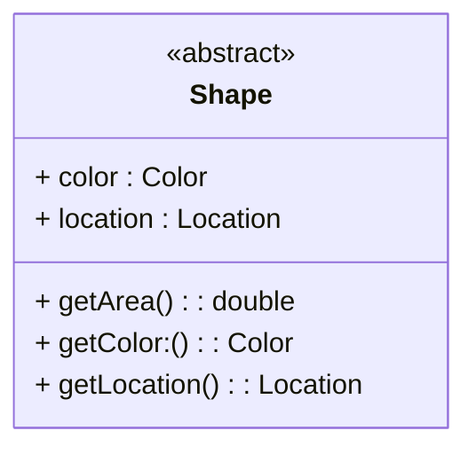
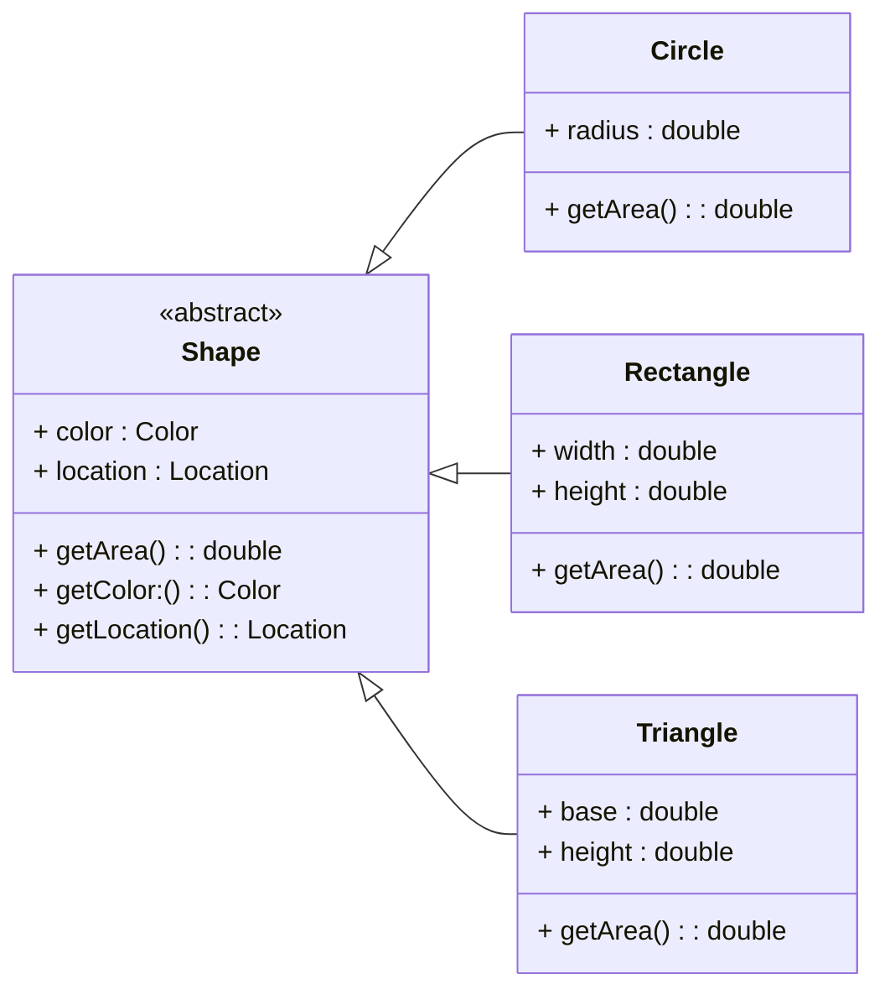
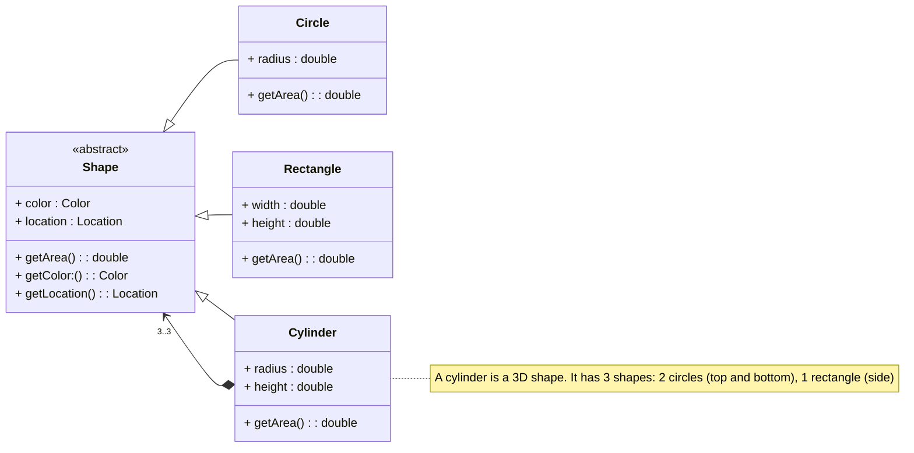
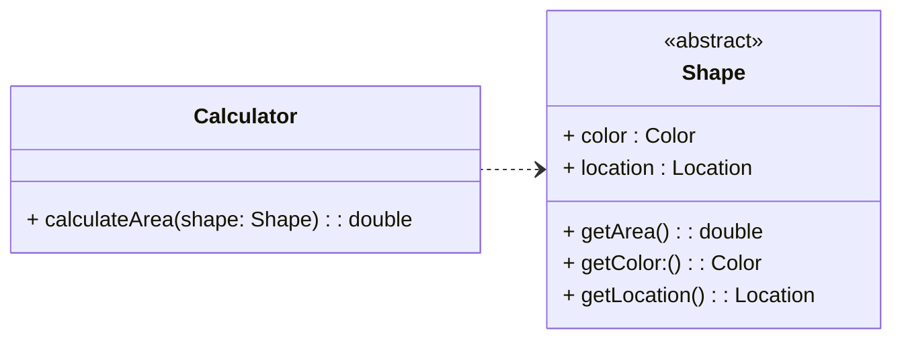
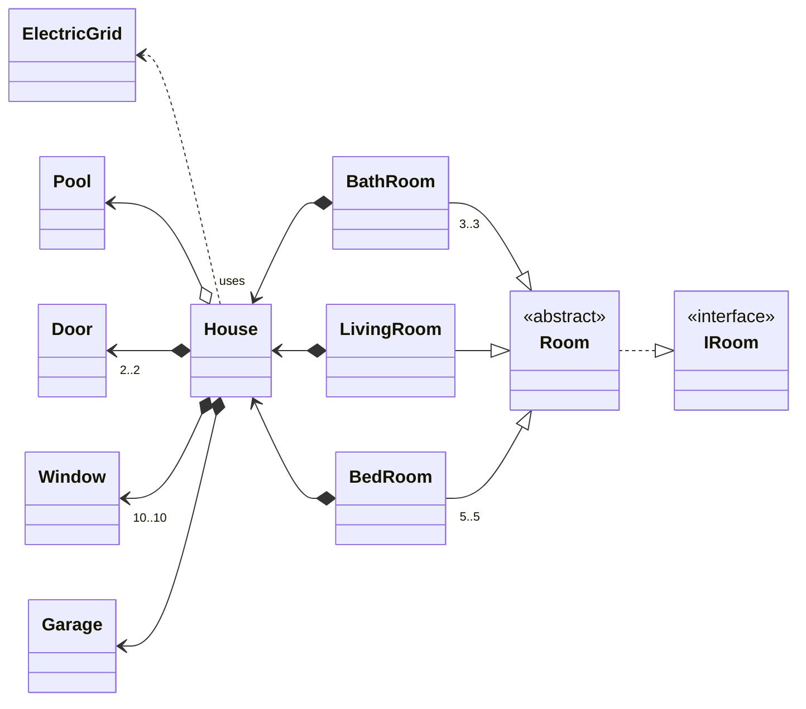

# UML - Class Diagram
- used to illustrate structure
- used to construct and vizualize object oriented relationships

Captured information:
1. Class information such as:
    - attributes
    - operations (methods)

2. Class relationships:
a. generalization - eg. inheritance between classes

b. association - eg. a class has a reference to another class

c. dependency - eg. a class uses another class

### House Example
