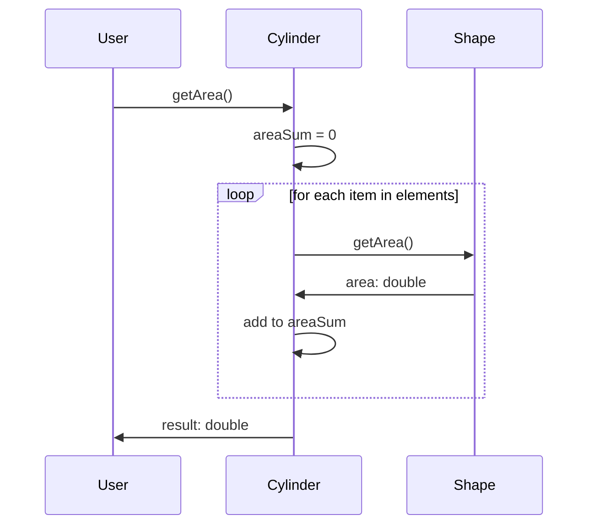

# UML - Sequence Diagram
- used to illustrate the behavior of a system/design
- used to visualize the sequence of messages exchanged between objects
Captures:
1. actors of the operation
2. method calls with data

