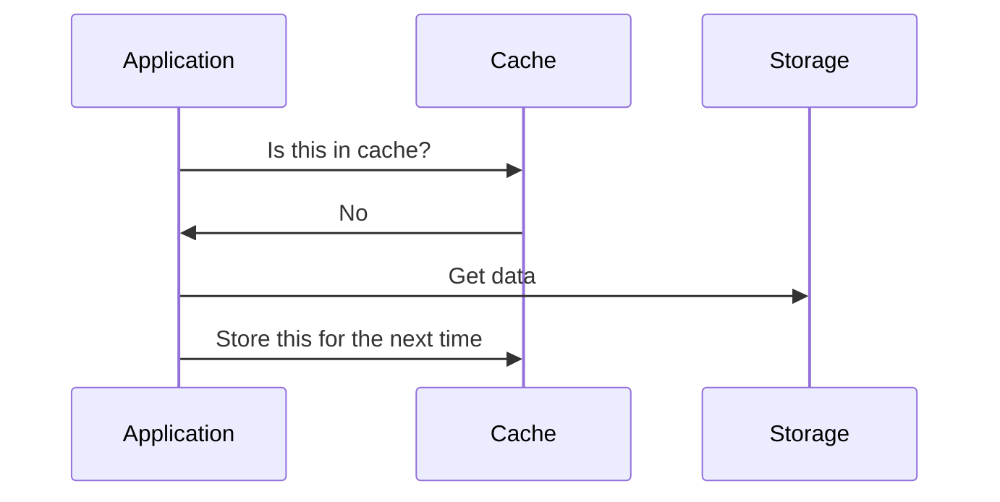
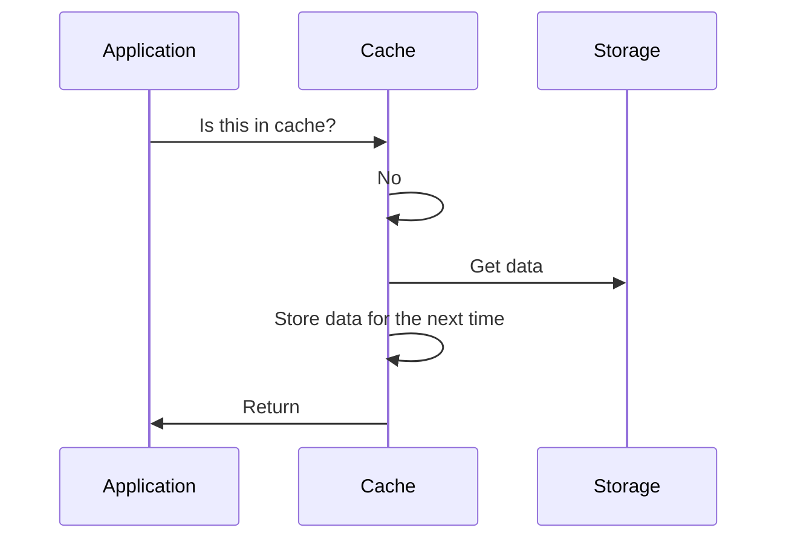
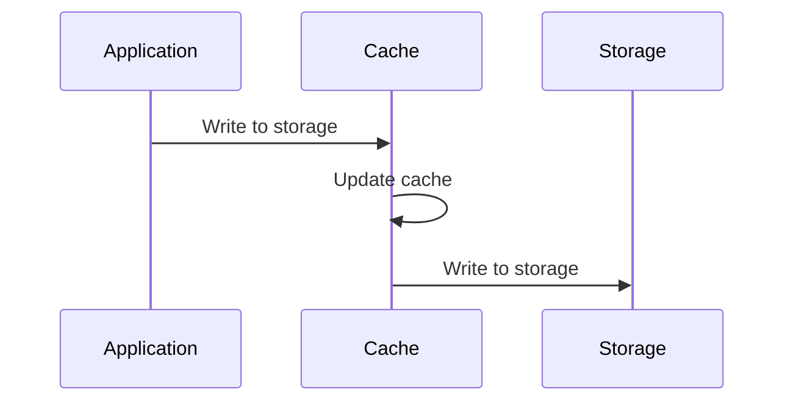
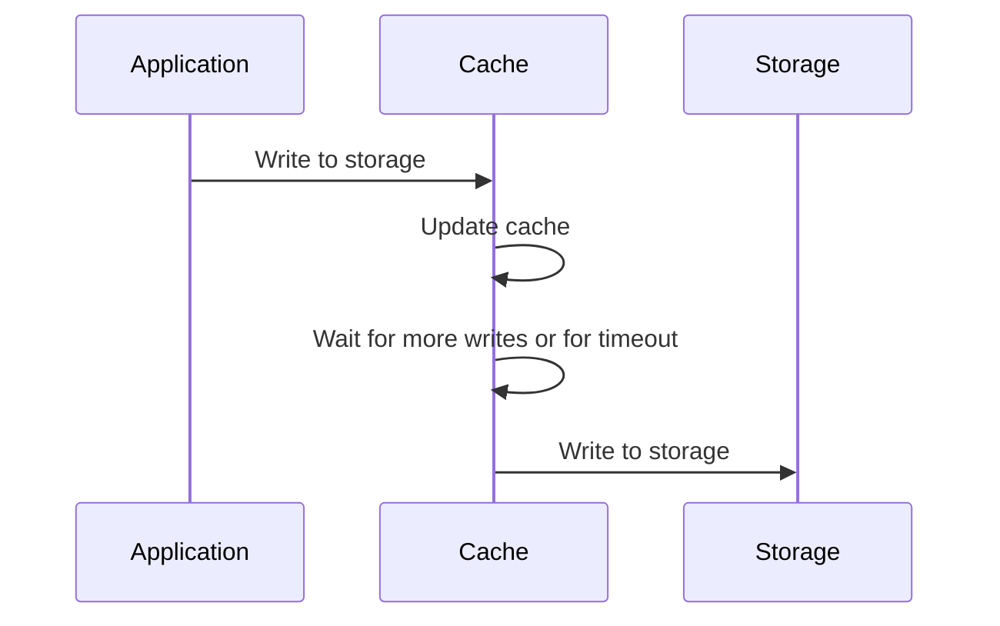

# Backend / Middleware

Role and Functionality of Middleware Services
Middleware services perform tasks that are necessary for the efficient operation of applications but are generally separated from the business logic layer. Here are some typical functionalities provided by middleware services:

1. Authentication and Authorization (auth): Handling security for applications by verifying user identities and ensuring they have permission to perform certain actions.
2. Data Management (cache): Including caching mechanisms (like Redis), database middleware that provides an abstraction layer over database operations, or services that manage session states across multiple servers.
3. Message Queuing (event-bus, queue): Middleware services like RabbitMQ, Apache Kafka, or AWS SQS provide a robust way to handle asynchronous communication between different parts of an application, improving reliability and scalability by decoupling the components.
4. API Management (gateway): Similar to API gateways, some middleware services manage API traffic, monitor and enforce policies like rate limiting, and provide analytics and logging.
5. Logging and Monitoring: Collecting, storing, and analyzing logs from various parts of an application to monitor its performance and troubleshoot issues.

## Placement in Application Architecture

Middleware services are typically deployed between the application layer and the system infrastructure:

- In the Cloud or On-Premise: Middleware services can be hosted in the cloud, taking advantage of cloud scalability and reliability, or can be deployed on-premise depending on the requirements for control and security.
- Integrated within Application Servers or as Standalone Services: Some middleware functions are built directly into application servers. Others operate as standalone services that communicate with the application via APIs or network protocols.

## Examples and Practical Integration

In a Node.js, Redis, and NGINX setup:

- Redis acts as a middleware service for caching, reducing the load on the Node.js servers by providing quick data retrieval for frequently accessed data.
- NGINX can be configured as a reverse proxy and load balancer, another form of middleware that manages incoming traffic and distributes it across multiple Node.js servers to ensure even load distribution and increased fault tolerance.

Middleware services are crucial in modern application architectures for enhancing performance, scalability, and reliability. They allow developers to focus on the core business logic while delegating common infrastructure-related functionalities to specialized components.

## Caching

Goal: speedup getting data from a slower storage by storing part of data in a faster storage

| Pros:                                    | Cons:                               |
| ---------------------------------------- | ----------------------------------- |
| - improve read performance (AKA latency) | - increases complexity of the setup |
| - reduce the load (AKA Throughput)       | - consumes resources                |

### Caching Strategies

1. Cache Aside
2. Read Through
3. Write Through
4. Write Behind

#### Cache Aside

| **Pros:**                   | **Cons:**                    |
| --------------------------- | ---------------------------- |
| - cache only what is needed | - cache misses are expensive |
|                             | - data is stateless          |
|                             | - implementation complexity  |

#### Read Through

| Prod                        | Cons                         |
| --------------------------- | ---------------------------- |
| - cache only what is needed | - cache misses are expensive |
| - transparent               | - data is stateless          |
|                             | - reliability                |

#### Write Through

| Prod              | Cons                   |
| ----------------- | ---------------------- |
| - up-to-date data | - writes are expensive |
|                   | - redundant data       |

#### Write Behind

| Prod                      | Cons                  |
| ------------------------- | --------------------- |
| - no write penalty        | - reliability         |
| - reduced load on storage | - lack of consistency |

### Eviction Policies

- LRU - Least Recently Used
  - suffers from false Cache eviction
  - if many keys are requested, it may evict popular keys that were not requested in a very short time
- LFR - Least Frequently Used
  - every key has a counter which is incremented every time it is accessed
  - on a cache-hit a key counter will get incremented
  - on a cache-miss the key with the lowest counter is evicted and a new key is added
  - elements that are accessed often, stay in cache forever

### Redis as Distributed Cache

- in memory value store
- key-value store
- limited by RAM memory
  - biggest servers are around 500Gb RAM at the moment
- supports 100k+ requests per seconds on a single node
  Data types:
- supports: string, list, set, hash and some others
- no support for JSON or nested data types

| keys     | values                                                                  |
| -------- | ----------------------------------------------------------------------- |
| "name"   | "James Bond"                                                            |
| "actors" | ["Sean Connery", "Pierce Brosnan", "Daniel Craig"]                      |
| "years"  | {"1962":"Sean Connery", "1994":"Pierce Brosnan", "2005":"Daniel Craig"} |

**TTL - Time To Live**

- Redis keys support TTLs
- when you put key in Redis you also tell for how long to store it
- very important for cache to save resource

**Persistance**

- Redis supports persistance and saves RAM to Disk
- used to recover cache from disk in case of Redis failures
